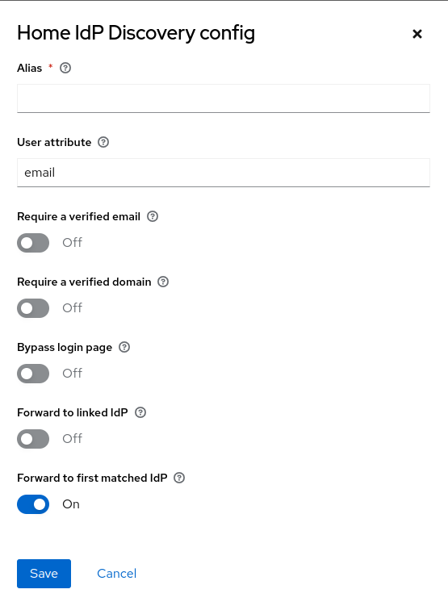

> :rocket: **Try it for free** in the new Phase Two [keycloak managed service](https://phasetwo.io/?utm_source=github&utm_medium=readme&utm_campaign=keycloak-orgs). Go to [Phase Two](https://phasetwo.io/) for more information.

# Organizations for Keycloak

*Single realm, multi-tenancy for SaaS apps*

This project intends to provide a range of Keycloak extensions focused on solving several of the common use cases of multi-tenant SaaS applications that Keycloak does not solve out of the box.

The extensions herein are used in the [Phase Two](https://phasetwo.io) cloud offering, and are released here as part of its commitment to making its [core extensions](https://phasetwo.io/docs/introduction/open-source) open source. Please consult the [license](COPYING) for information regarding use.

> :exclamation: See [our note regarding Keycloak's upcoming organizations feature](./docs/note-keycloak-organizations-feature.md).

## Contents

- [Organizations for Keycloak](#organizations-for-keycloak)
  - [Contents](#contents)
  - [Overview](#overview)
    - [Definitions](#definitions)
  - [Quick start](#quick-start)
  - [Building](#building)
  - [Cypress-Test](#cypress-test)
  - [Installation](#installation)
    - [Admin UI](#admin-ui)
    - [Compatibility](#compatibility)
  - [Extensions](#extensions)
    - [Data](#data)
      - [Models](#models)
      - [Entities](#entities)
    - [Resources](#resources)
    - [Mappers](#mappers)
    - [Events](#events)
    - [Authentication](#authentication)
      - [Invitations](#invitations)
      - [IdP Discovery](#idp-discovery)
    - [Import/Export organizations](#importexport-organizations)
    - [Active Organization](#active-organization)
  - [License](#license)

## Overview

If you search for "multi-tenant Keycloak", you'll find several opinionated approaches, each promising, and each with their own trade-offs. This project represents one such approach. It was built initially for a multi-tenant, public cloud, SaaS application. It has now been, in the form of the [Phase Two](https://phasetwo.io) cloud offering, adopted by several other companies for the same purpose.

Other approaches that we tried and decided against were:

- One Realm for each tenant
- Using existing Keycloak Groups to model Organizations, Roles and Memberships

But each of these approaches had trade-offs of scale or frailty we found undesirable or unacceptable to meet our requirements. Instead, we opted to make Organizations, and their Invitations, Roles and Memberships first-class entities in Keycloak.

We recently did a presentation at Keycloak DevDay 2024 on the features of the keycloak-orgs extension. Watch the full video for an introduction and more information about what is possible
[](https://www.youtube.com/watch?v=DNq51wWw3F4)

### Definitions

- **Organizations** are "tenants" or "customers" as commonly used. A Realm can have multiple Organizations.
- **Memberships** are the relationship of Users to Organizations. Users may be members of multiple Organizations.
- **Roles** are mechanisms of role-based security specific to an Organization, much like Keycloak Realm Roles and Client Roles. In addition to a set of standard roles related to Organization data visibility and management, administrators can create Roles unique to an organization. Users who are Members of Organizations can be granted that Organization's Roles.
- **Invitations** allow Users and non-Users to be invited to join an Organization. Invitations can be created by administrators or Organization members with permission.
- **Domains** are email domains that are used to automatically select Organization IdPs using the optional authenticators. Included is a facility to validate customer domain ownership using DNS records.

## Quick start

The easiest way to get started is our [Docker image](https://quay.io/repository/phasetwo/phasetwo-keycloak?tab=tags). Documentation and examples for using it are in the [phasetwo-containers](https://github.com/p2-inc/phasetwo-containers) repo. The most recent version of this extension is included.

## Building and testing

Checkout this project and run `mvn clean install`, which will build the source, run all unit/integration tests, and produce a jar in the `target/` directory.

### Cypress tests

For more information you can refer to [cypress-tests](./docs/cypress-tests.md).

## Installation

The maven build only produces a jar of the code here, and some additional libraries are necessary when using this library. If you are intending to use this library outside of the [Phase Two Docker image](https://quay.io/repository/phasetwo/phasetwo-keycloak), please consult the `pom.xml` file in the [phasetwo-containers repo](https://github.com/p2-inc/phasetwo-containers/blob/main/libs/pom.xml) for more information on what is required. Furthermore, there are some uses of the `keycloak-admin-client` by this library. Because of the way Quarkus does augmentation of this dependency, it is necessary to include this when building Keycloak itself. Our image has these changes, but they will [never be included](https://github.com/keycloak/keycloak/issues/25589) in the default Keycloak image. We encourage you to either use our [base Docker image](https://quay.io/repository/phasetwo/keycloak-crdb) that includes this, or see the [`pom.xml` diffs](https://github.com/keycloak/keycloak/compare/24.0.3...p2-inc:keycloak:24.0.3_crdb#diff-398bf5e6ab6c70cc2fa4c088f20e15b2a3777e8e67b82afe65b5784226bc07cb) for an example of how to do it yourself.

During the first run, some initial migrations steps will occur:

- Database migrations will be run to add the tables for use by the JPA entities. These have been tested with SQL Server, MySQL, MariaDB, H2, and Postgres. Other database types may fail.
- Initial `realm-management` client roles (`view-organizations` and `manage-organizations`) will be be added to each realm.

### Admin UI

If you are using the extension as bundled in the [Docker image](https://quay.io/repository/phasetwo/phasetwo-keycloak) or by building our [Admin UI theme](https://github.com/p2-inc/keycloak-ui), you must take an additional step in order to show that theme. In the Admin Console UI, go to the *Realm Settings* -> *Themes* page and select `phasetwo.v2`. Then, the "Organizations" section will be available in the left navigation. Because of a quirk in Keycloak, if you are logging in to the `master` realm, the theme must be set in *that* realm, rather than the realm you wish to administer.  

### Compatibility

Although it has been developed and working since Keycloak 9.0.0, the extensions are currently known to work with Keycloak > 17.0.0. Other versions may work also. Additionally, because of the fast pace of breaking changes since Keycloak "X" (Quarkus version), we don't make any guaranteed that this will work with any version other than it is packaged with in the [Docker image](https://quay.io/repository/phasetwo/phasetwo-keycloak).

## Extensions

### Data

We've adopted a similar model that Keycloak uses for making the Organization data available to the application. There is a custom SPI that makes the [OrganizationProvider](src/main/java/io/phasetwo/service/model/OrganizationProvider.java) available. The methods provided are:

```java
  OrganizationModel createOrganization(
      RealmModel realm, String name, UserModel createdBy, boolean admin);

  OrganizationModel getOrganizationById(RealmModel realm, String id);

  Stream<OrganizationModel> searchForOrganizationStream(
      RealmModel realm,
      Map<String, String> attributes,
      Integer firstResult,
      Integer maxResults,
      Optional<UserModel> member);

  Long getOrganizationsCount(RealmModel realm, String search);

  boolean removeOrganization(RealmModel realm, String id);

  void removeOrganizations(RealmModel realm);

  Stream<OrganizationModel> getOrganizationsStreamForDomain(
      RealmModel realm, String domain, boolean verified);

  Stream<OrganizationModel> getUserOrganizationsStream(RealmModel realm, UserModel user);

  Stream<InvitationModel> getUserInvitationsStream(RealmModel realm, UserModel user);
```

#### Models

The OrganizationProvider returns model delegates that wrap the underlying entities and provide conveniences for working with the data. They are available in the `io.phasetwo.service.model` package.

- [OrganizationModel](src/main/java/io/phasetwo/service/model/OrganizationModel.java)
- [OrganizationRoleModel](src/main/java/io/phasetwo/service/model/OrganizationRoleModel.java)
- [InvitationModel](src/main/java/io/phasetwo/service/model/InvitationModel.java)
- [DomainModel](src/main/java/io/phasetwo/service/model/DomainModel.java)

#### Entities

There are JPA entities that represent the underlying tables that are available in the `io.phasetwo.service.model.jpa.entity` package. The providers and models are implemented using these entities in the `io.phasetwo.service.model.jpa` package.

- [OrganizationEntity](src/main/java/io/phasetwo/service/model/jpa/entity/OrganizationEntity.java)
- [OrganizationAttributeEntity](src/main/java/io/phasetwo/service/model/jpa/entity/OrganizationAttributeEntity.java)
- [OrganizationMemberEntity](src/main/java/io/phasetwo/service/model/jpa/entity/OrganizationMemberEntity.java)
- [OrganizationRoleEntity](src/main/java/io/phasetwo/service/model/jpa/entity/OrganizationRoleEntity.java)
- [UserOrganizationRoleMappingEntity](src/main/java/io/phasetwo/service/model/jpa/entity/UserOrganizationRoleMapping.java)
- [InvitationEntity](src/main/java/io/phasetwo/service/model/jpa/entity/InvitationEntity.java)
- [DomainEntity](src/main/java/io/phasetwo/service/model/jpa/entity/DomainEntity.java)

### Resources

A group of custom REST resources are made available for administrator and customer use and UI. Current documentation on the available resource methods is in this [openapi.yaml](https://github.com/p2-inc/phasetwo-docs/blob/master/openapi.yaml) specification file, and you can find browsable documentation on the [Phase Two API](https://phasetwo.io/api/) site.

- Organizations - CRUD Organizations
- Memberships - CRUD and check User-Organization membership
- Roles - CRUD Organization Roles and grant/revoke Roles to Users
- [Bulk Roles](./docs/bulk-roles.md) - support for bulk Roles resources
- Identity Providers - A subset of the Keycloak IdP APIs that allows Organization administrators to manage their own IdP

### Events

For more information you can refer to: [Events](./docs/events.md)

### Import/Export organizations

For more information you can refer to: [Import/Export](./docs/import-export.md)

### Mappers

There are currently two OIDC mapper that adds either Organization attributes or Organization membership and roles to the token. An example of the format of the membership addition to the token is:

```json
  "organizations": {
    "5aeb9aeb-97a3-4deb-af9f-516615b59a2d" : {
      "name": "foo",
      "roles": [ "admin", "viewer" ]
    }
  }
```

You can configure the mapper, by going to **Clients** > ***your-client-name*** > **Client scopes** > ***your-client-name*-dedicated** and choosing to add a new mapper **By configuration**. Once selected, choose the **Organization Role** mapper from the list and specify the details like the following:


### Authentication

#### Invitations

For most use cases, set the `Invitation` required action to `Enabled` in *Authentication*->*Required Actions*. It does not need to be set as a default. It will automatically check on each login if the user has outstanding Invitations to Organizations, and enable itself.


There are some non-standard flows where the required action does not do this detection. For these cases, there is a custom Authenticator you can add to a copy of the standard browser flow. Add the `Invitation` authenticator as a "REQUIRED" execution following the "Username Password Form" as a child of the forms group. Both the Required Action and the Authenticator check to see if the authenticated user has outstanding Invitations to Organizations, and then adds the Required Action that they must complete to accept or reject their Invitations following a successful authentication.

Note that it is a default to require that an email address be _verified_, as it would present a security issue to allow anyone who uses an email address to register to join an organization without verifying that the user is the owner of that email address. Because of that, it is assumed that you are using invitations in conjunction with setting *Verify Email* as a _default_ Required Action.

#### IdP Discovery

Organizations may optionally be given permission to manage their own IdP. The custom resources that allow this write a configuration in the IdP entities that is compatible with a 3rd party extension that allows for IdP discovery based on email domain configured for the Organization. It works by writing the `home.idp.discovery.orgs` value into the `config` map for the IdP. Information on further configuration is available at [sventorben/keycloak-home-idp-discovery](https://github.com/sventorben/keycloak-home-idp-discovery). However, please note that the internal discovery portion has been *forked* from his version, and does not look up IdPs in the same way.



These are the configuration options for the "Home IdP Discovery" Authenticator. It will need to be placed in your flow as a replacement for a "Username form", or after another Authenticator/Form that sets the `ATTEMPTED_USERNAME` note. 

### Active Organization

It is possible to define an active organization and switch it. It's currently based on user's attribute and the active organization id, name, role or attribute can be mapped into tokens with a configurable mapper.  
For more information you can refer to [active-organization](./docs/active-organization.md).

## License

We’ve changed the license of our core extensions from the AGPL v3 to the [Elastic License v2](https://github.com/elastic/elasticsearch/blob/main/licenses/ELASTIC-LICENSE-2.0.txt). 

- Our blog post on the subject https://phasetwo.io/blog/licensing-change/
- An attempt at a clarification https://github.com/p2-inc/keycloak-orgs/issues/81#issuecomment-1554683102

-----

Portions of the [Home IdP Discovery](https://github.com/p2-inc/keycloak-orgs/tree/main/src/main/java/io/phasetwo/service/auth/idp) code are Copyright (c) 2021-2024 Sven-Torben Janus, and are licensed under the [MIT License](https://github.com/p2-inc/keycloak-orgs/blob/main/src/main/java/io/phasetwo/service/auth/idp/LICENSE.md).

All other documentation, source code and other files in this repository are Copyright 2024 Phase Two, Inc.
