# Active Organizations Authenticator

## Contents
<!-- TOC -->
* [Active Organizations Authenticator](#active-organizations-authenticator)
  * [Contents](#contents)
  * [Overview](#overview)
  * [Explanation](#explanation)
    * [prompt=select_account](#promptselect_account)
    * [account_hint](#account_hint)
    * [account switching](#account-switching)
  * [Built-in Flows](#built-in-flows)
    * [Select Org Browser Flow](#select-org-browser-flow)
      * [Configuration](#configuration)
      * [Flow](#flow)
    * [Select Org Direct Grant Flow](#select-org-direct-grant-flow)
      * [Configuration](#configuration-1)
      * [Flow](#flow-1)
  * [Configuration & Example](#configuration--example)
    * [Browser Flow (Configuration)](#browser-flow-configuration)
      * [Examples (Tests)](#examples-tests)
    * [Direct Grant Flow (Configuration)](#direct-grant-flow-configuration)
<!-- TOC -->

## Overview
This documentation is dedicated to the use of "Select Organization" Authenticator.  
Note that to have the active_organization information into tokens, you still need the "Active Organization" mapper.

## Explanation
You can add the `Select Organization` authenticator into the user authentication flow.  
With this authenticator enabled, you can pass the query parameters:
- `prompt=select_account`
- `account_hint={ORG-ID}`

In all case, if the use try to access an organization where he isn't a member, an error will be returned.

### prompt=select_account
If the `prompt=select_account` is given for the authentication flow, the user will be requested to select an organization during login.  
Note that:
- If the user doesn't have any organization, an error is returned.  
- If the user has only 1 organization, the selection will be skipped, and it will use this organization.

_Example of authentication request:_  
- `{HOSTNAME}/realms/{REALM}/protocol/openid-connect/auth?response_type=code&client_id={PUBLIC-CLIENT}&scope=openid&redirect_uri={HOSTNAME}/realms/{REALM}/account&prompt=select_account`

### account_hint
If the `account_hint={ORG-ID}` is given for the authentication flow, it will use the given organization without having to select one.   
_Example of authentication request:_  
- `{HOSTNAME}/realms/{REALM}/protocol/openid-connect/auth?response_type=code&client_id={PUBLIC-CLIENT}&scope=openid&redirect_uri={HOSTNAME}/realms/{REALM}/account&account_hint={ORG-ID}`  

_or with the `prompt=select_account`_:
- `{HOSTNAME}/realms/{REALM}/protocol/openid-connect/auth?response_type=code&client_id={PUBLIC-CLIENT}&scope=openid&redirect_uri={HOSTNAME}/realms/{REALM}/account&prompt=select_account&account_hint={ORG-ID}`

### account switching
To **switch account based on account_hint**, you will need to define the 'Select Organization' step after the Cookie step. For that, you will need to
define a Sub-Flow like this:  
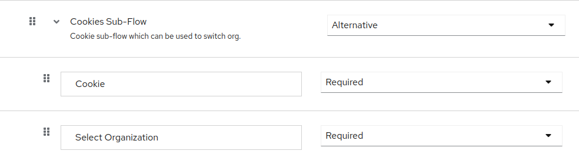

Then making an authentication request with **account_hint**: 
- `{HOSTNAME}/realms/{REALM}/protocol/openid-connect/auth?response_type=code&client_id={PUBLIC-CLIENT}&scope=openid&redirect_uri={HOSTNAME}/realms/{REALM}/account&account_hint={ORG-ID}`  

Will skip the select organization form and switch the organization (change user's attribute).

## Built-in Flows
A **browser flow** and **direct grant flow** have been added. They are similar to the default Keycloak built-in flows but include the Select Organization step.

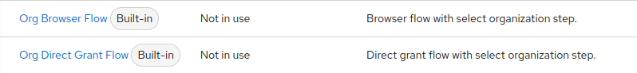  

### Select Org Browser Flow
#### Configuration
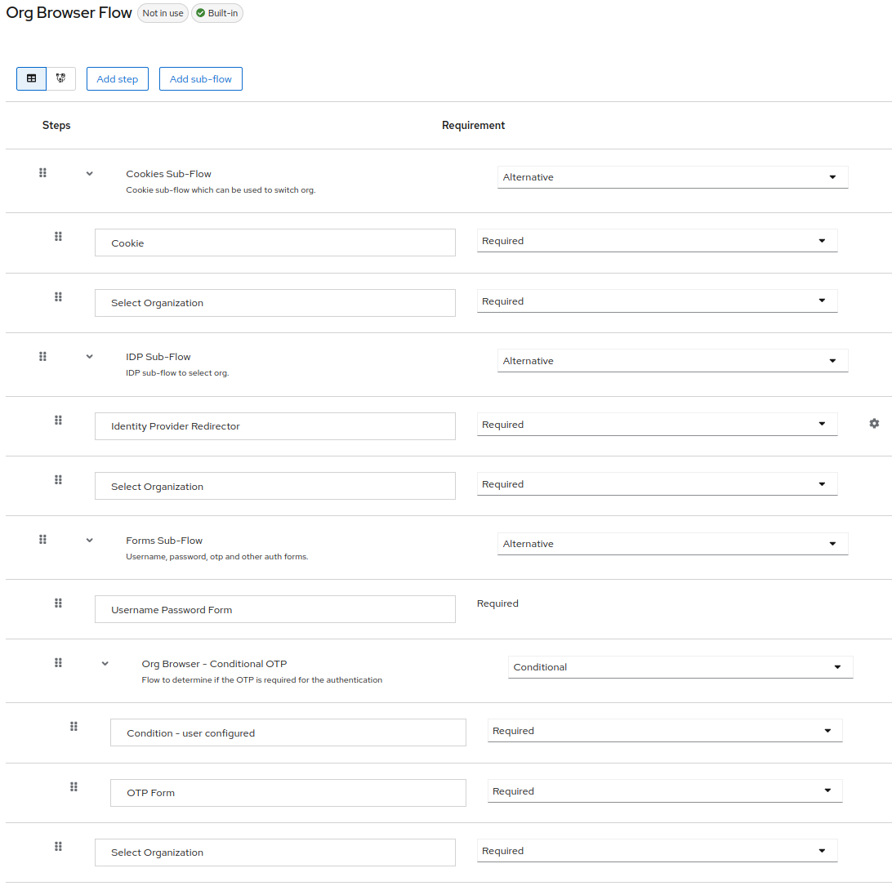

#### Flow
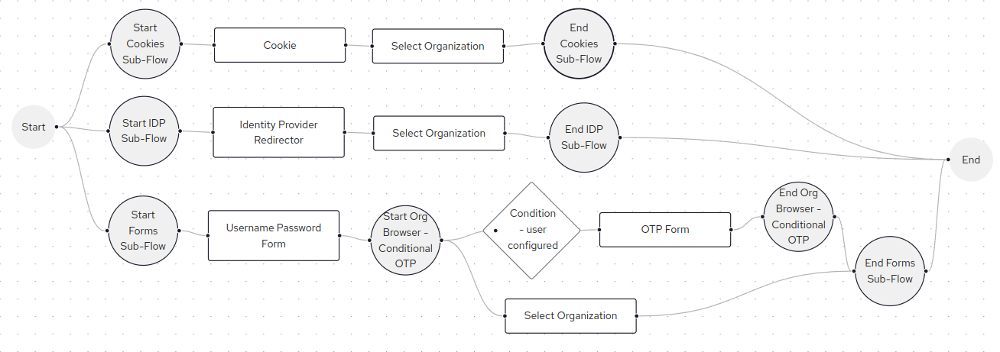

### Select Org Direct Grant Flow
#### Configuration
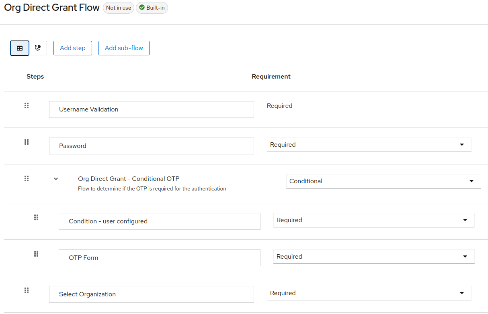

#### Flow
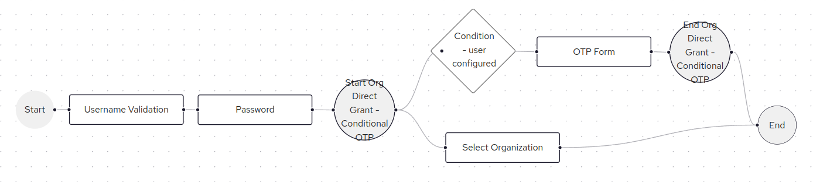

## Configuration & Example

### Browser Flow (Configuration)
To configure the Browser Flow, you need to duplicate the default `Browser flow` and modify it.  
In the `forms` part _(with Username Password Form)_, select `Add Step`.

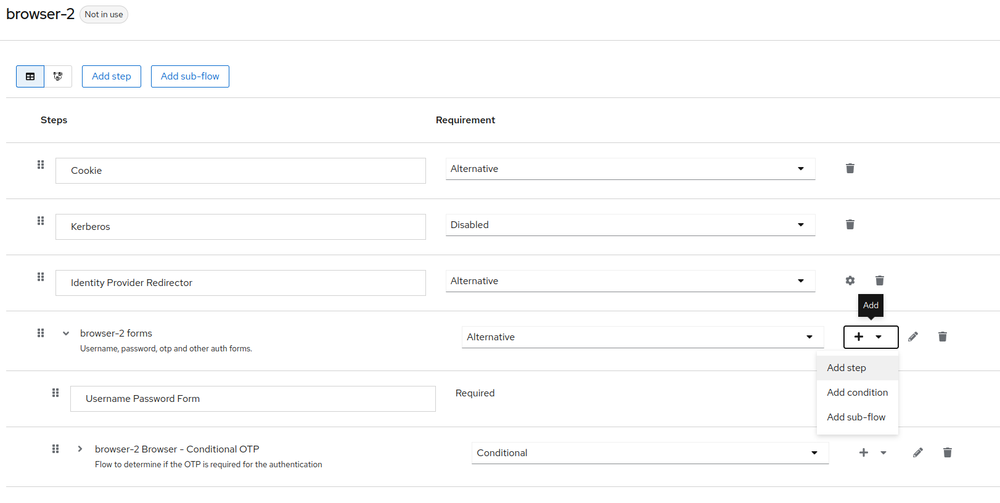

In the selection, search and select `Select Organization`.

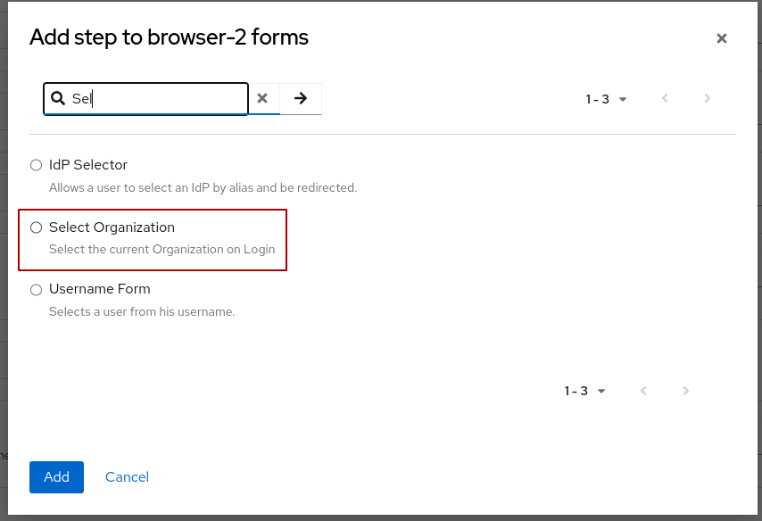

Once selected, enable it by setting it to `Required`.

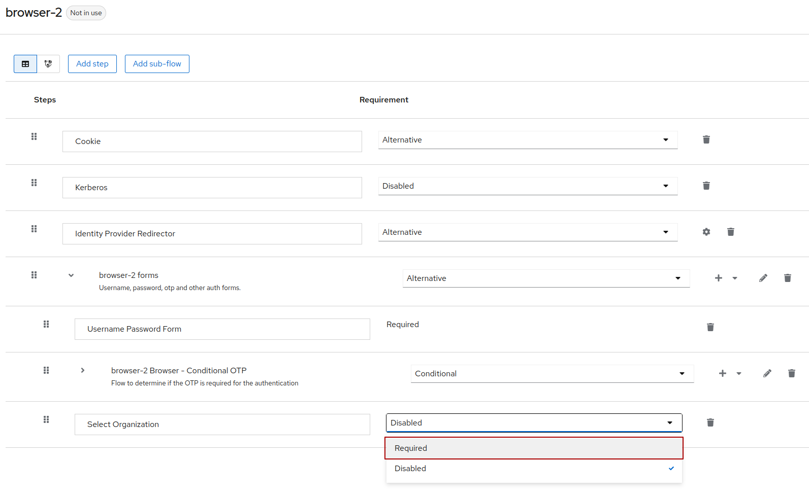

Don't forget to bind this flow to "Browser flow".

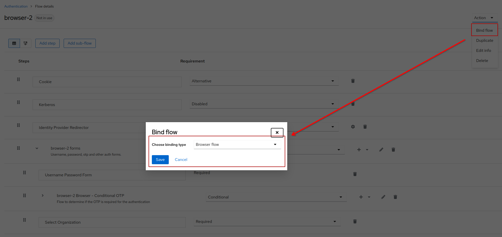

#### Examples (Tests)
Once configured, you can test the authenticator with an authentication request including `prompt=select_account`.  
**Example:** `{HOSTNAME}/realms/{REALM}/protocol/openid-connect/auth?response_type=code&client_id={PUBLIC-CLIENT}&scope=openid&redirect_uri={HOSTNAME}/realms/{REALM}/account&prompt=select_account`.  

Once the user enter his username (or email) and password, he will have a drop-down to select an organization.

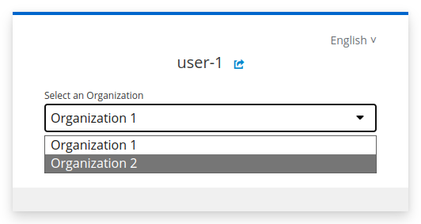

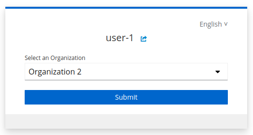

If the user has no organization, instead of the selection step, he will get an Error message.

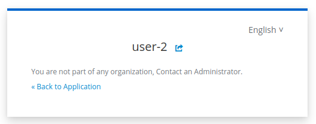

If the user try to access an organization where is not a member (with `account_hint` for example), he will also get an error message.

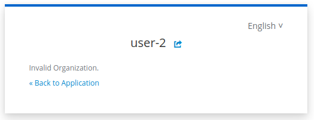

Not that doing the authentication request with `account_hint={ORG-ID}` will skip the selection during log-in but still verify that the user has an organization or has membership.

### Direct Grant Flow (Configuration)

`account_hint={ORG-ID}` of "Select Organization" authenticator can also be used for a `Direct Grant` flow. 
For that, apply the same configuration as the browser flow to the direct grant flow.

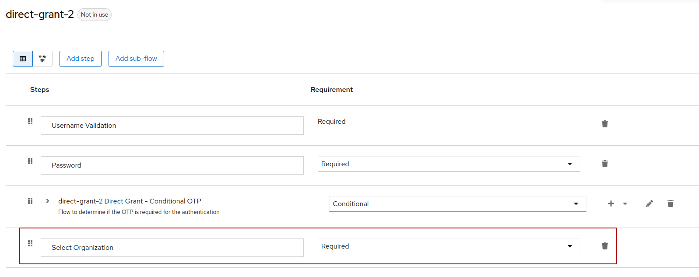

Then, when you make the direct grant authentication, you can pass the query parameter `account_hint{ORG-ID}` and it will be used to define the active_organization.

**Example:**  
`{{HOSTNAME}}/realms/{{REALM}}/protocol/openid-connect/token?account_hint={ORG-ID}`

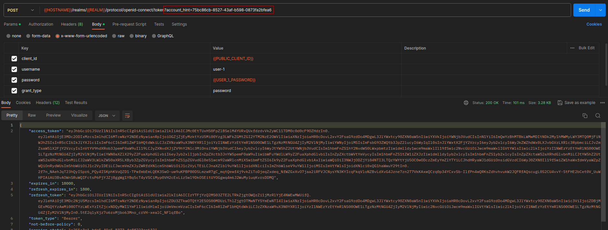
