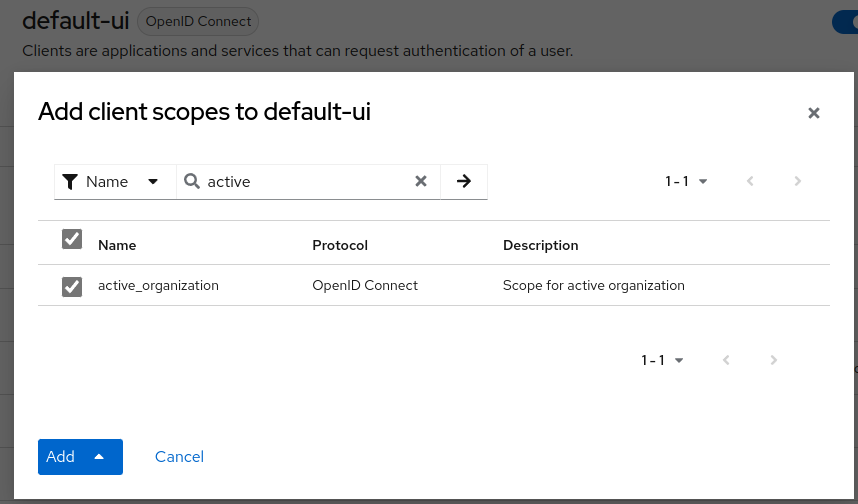

# Active Organizations feature

## Contents
<!-- TOC -->
* [Active Organizations feature](#active-organizations-feature)
  * [Contents](#contents)
  * [Overview](#overview)
    * [Currently supported mode](#currently-supported-mode)
      * [Important note (`ATTRIBUTE_MODE`) before v24.x+](#important-note-attribute_mode-before-v24x)
    * [Code extension](#code-extension)
  * [Endpoints](#endpoints)
    * [Switch Organization](#switch-organization)
    * [Active organization](#active-organization)
  * [Mappers](#mappers)
    * [New mapper](#new-mapper)
    * [Configure the mapper](#configure-the-mapper)
  * [Standard Flow (Demo)](#standard-flow-demo)
  * [Attack Scenario and Mitigation (before v24.x+)](#attack-scenario-and-mitigation-before-v24x)
    * [Case with user read only attributes](#case-with-user-read-only-attributes)
    * [Case with no user read only attributes](#case-with-no-user-read-only-attributes)
<!-- TOC -->

## Overview
### Currently supported mode
Currently, there is only one supported mode for "active organization" which is based on user's attributes (`ATTRIBUTE_MODE`). 
This means that the active organization is kept in the user's attributes, he doesn't need to select an organization each time he logs in.  
- Upon login, the last active organization will be used.  
- If the user doesn't have an active organization attribute and belong to one or more organization, the first one is taken by default.  
- Switching organization create a new session for the user (it return a new access token).

#### Important note (`ATTRIBUTE_MODE`) before v24.x+
**Starting of the version 24.x+, the org.ro.active is not visible and not editable by standard users.**
Currently, the attribute key for active organization is not configurable and is by default `org.ro.active`.  
It follows this format as it can be set as read-only with `--spi-user-profile-declarative-user-profile-read-only-attributes=org.ro.*` 
of Keycloak which is **recommended**.  
_So a standard user isn't able to modify it for any [malicious purpose](#attack-scenario-and-mitigation). 
If not set as read-only, some mitigation were implemented_.

### Code extension
Several files have been added or modified to cover the "active organization" feature:
- [Added `ActiveOrganizationMapper.java`](../src/main/java/io/phasetwo/service/protocol/oidc/mappers/ActiveOrganizationMapper.java)
  - A configurable mapper which can map to tokens: id, name, role and / or attribute.
- [Added `SwitchOrganization.java`](../src/main/java/io/phasetwo/service/representation/SwitchOrganization.java)
  - This file is used as body validation of switch organization request.
- [Added `util.ActiveOrganiztion.java`](../src/main/java/io/phasetwo/service/util/ActiveOrganization.java)
  - This file is in charge to deal with several process to avoid code duplication.
- [Added `util.TokenManager.java`](../src/main/java/io/phasetwo/service/util/TokenManager.java)
  - This file is in charge to generate a new set of tokens (access, refresh, ...) after organization switch.
- [Modified `Orgs.java`](../src/main/java/io/phasetwo/service/Orgs.java)
  - To add a new constants for active organization attribute key.
- [Modified `UserResource.java`](../src/main/java/io/phasetwo/service/resource/UserResource.java)
  - To add 2 new endpoints to switch active organization and get the active organization.
- [Modified `AbstractOrganizationTest.java`](../src/test/java/io/phasetwo/service/AbstractOrganizationTest.java)
  - To extend the abstract functionalities for testing (create client, create client-scope, assign client role, get user account, ...)
- [Modified `OrganizationResourceTest.java`](../src/test/java/io/phasetwo/service/resource/OrganizationResourceTest.java)
  - Added `void testOrganizationSwitch()` to cover the switch organization logic with standard flow or 'malicious attack'.

## Endpoints
2 new endpoints were added.
### Switch Organization
This endpoint allow a user to switch organization.

Method: `PUT`  
Path: `:realm/users/switch-organization`  
Body: ```{ "id": "e8370df3-dab8-45d4-b95f-031f7e80dfc7" }```

Possible Response:
- 200: OK
  - Body contains a new access token, refresh token, ... same as keycloak `/token` endpoint.
- 401: Unauthorized
  - When the user try to switch to an organization where he is not a member.

Note that switching organization create a new session for the user.

### Active organization
This endpoint allow a user to get its active organization.

Method: `GET`  
Path: `:realm/users/active-organization`

Possible Response:
- 200: OK
    - Body contains the active organization [representation](../src/main/java/io/phasetwo/service/representation/Organization.java).
- 401: Unauthorized
  - When the user isn't a member of the organization defined by the "active organization" attribute.
- 404: Not found
  - When the user don't belong to an organization.

## Mappers
### New mapper


### Configure the mapper
**1. Create client scope**  

In your realm Client scopes, add a new client-scope, set the configuration and name as you wish.


**2. Use the active organization mapper**


**3. Configure the mapper**  

By default, all properties are pre-configured. You can remove what you want and the mapper will adjust the claim.

_Example with all pre-configured properties_:  


Will produce this claim in token:
```json
  "active_organization": {
    "role": [
      "view-organization",
      "view-members",
      "view-roles"
    ],
    "name": "My Organization",
    "id": "75bc86cb-8527-43af-b598-0873fa2bfea6",
    "attribute": {
      "test": [
        "test"
      ]
    }
  },
```

_Example with only id property_:  


Will produce this claim in token:
```json
  "active_organization": {
    "id": "75bc86cb-8527-43af-b598-0873fa2bfea6"
  },
```


**4. Add new client scope to public client**  

On your public client (used by your FE application) add the newly created client scope.  




**5. Token claims**  
Then, after authentication, you should have the active organization info into the token claims.  


## Standard Flow (Demo)
For this demo, 
- 3 different organizations has been created.
- 1 standard user has been created (with `manage-account` role).
  - This user was added to Organization 1 and Organization 2.
- 1 public client has been created.
- 1 `active_organization` client scope has been created with the "Active Organization" pre-configured mapper and assigned to the public client.

The standard user is used for the demo flow.

**1. Get initial account state.**  
First, we get the current account state of the user. Here we can see there is currently no `org.ro.active` attribute. 


**2. Get current user's available organizations.**  
There, we get the organizations which the user is a member.


**3. Get current user's active organization.**  
We try to get the active organization of the user.  
As you may have notified in the account state response, 
the user doesn't have an active organization attribute, so we have the first one by default.


**4. Switch to other organization (member).**  
We try to switch to the other organization which the user is a member. 


As you can see, the request is successful, and we get a new **access_token**. 
If you decode this new token, you will see that it contains the new active organization data.  


**5. Get new account state.**  
Let's get the user account state.  


As you can see, the `org.ro.active` attribute have been populated with the requested organization.

**6. Switch to other organization (not a member).**  
Now, let's try to switch to the Organization 3, where the user is not a member.  


As you can see, the user can't perform this action.

**End.**

Side note, if the user tries to get the active-organization without belonging to an organization, 
the `404 NOT FOUND` response will be returned.


## Attack Scenario and Mitigation (before v24.x+)
**Starting of the version 24.x+, the org.ro.active is not visible and not editable by standard users.**

Now, let's assume the standard user is malicious and knows a little about Keycloak.  
He may think that he could change organization by directly writing the `org.ro.active` attribute.

### Case with user read only attributes
If you have defined the pattern `org.ro.*` as read-only as it was recommended in the 
[important note](#important-note-attribute_mode), the user can't modify this attribute.  
He will get a `400 BAD REQUEST` response instead.


### Case with no user read only attributes
Now, if you don't have or can't define the pattern `org.ro.*` as read-only, no need to panic, 
some mitigation measures have been implemented.

Let's imagine the user is able to make a "successful" `POST` request to modify this attribute. 


As you can see, he will get a `204 NO CONTENT` response (success).  
Now, he checks on its attributes if the action was indeed successful.


Which seems to be the case, as the new active organization id match the one defined in the update account request.  
**However**, if he tries to get the active-organization information now:


He will get a `401 UNAUTHORIZED` response. It's because we always check that the user actually belongs 
to the organization before returning the information.  
Also, he may try to re-authenticate to see if the token claims contains the new active organization data 
(so he can get access to this organization features on your platform).


But actually the active organization claims **will be empty too**.   
For the same reason as before, we always check that the user actually belongs
to the organization before mapping claims into the token.
