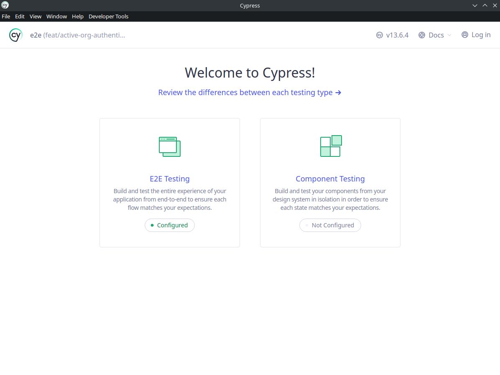

# Cypress Tests

## Contents
<!-- TOC -->
* [Cypress Tests](#cypress-tests)
  * [Contents](#contents)
  * [Setup](#setup)
    * [pnpm](#pnpm)
    * [cypress.config.ts](#cypressconfigts)
  * [Running with Cypress](#running-with-cypress)
  * [Cypress Testcontainers](#cypress-testcontainers)
<!-- TOC -->

## Setup
Versions used:
- Node: **20.9.0**
- npm: **10.2.3**
- pnpm: **8.10.2**

### pnpm
Cypress setup use pnpm, you will first need to install it:
```bash
npm install -g pnpm
```

Then in the `test/e2e` folder, install the dependencies
```bash
pnpm install
```

### cypress.config.ts
To configure cypress for you setup, modify `cypress.config.ts`.
```typescript
export default defineConfig({
  e2e: {
    baseUrl: 'http://localhost:8080/',
    reporter: 'cypress-multi-reporters',
    reporterOptions: {
      configFile: 'reporter-config.json'
    }
  },
});
```
For example, if your Keycloak instance or container is not running on http://localhost:8080/, modify it.  

## Running with Cypress
After the setting up your environment and configuring your `cypress.config.ts`. 
You start cypress UI by executing the command 
```bash
npx cypress open
```
in `test/e2e` folder.

You should get the Cypress UI.  


Then, click on `E2E Testing`, choose the browser you want and click on `Start E2E Testing in ...`.  
After that, you can choose any `*.cy.ts` file in `Specs` to run the tests and debug.

## Cypress Testcontainers
A Cypress testcontainers based on https://github.com/wimdeblauwe/testcontainers-cypress is used.  
It populates dynamically the baseUrl with the Keycloak testcontainers instance and run all tests in the 
`test/e2e` folder.

To run the tests with the testcontainers, run the `runCypressTests()` in `CypressOrganizationTest.java` like any Junit test.
