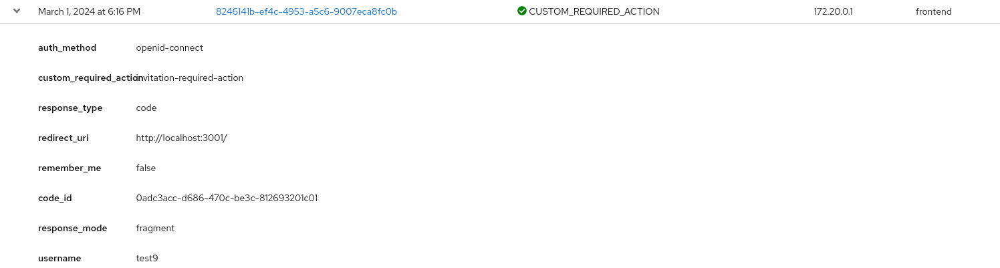
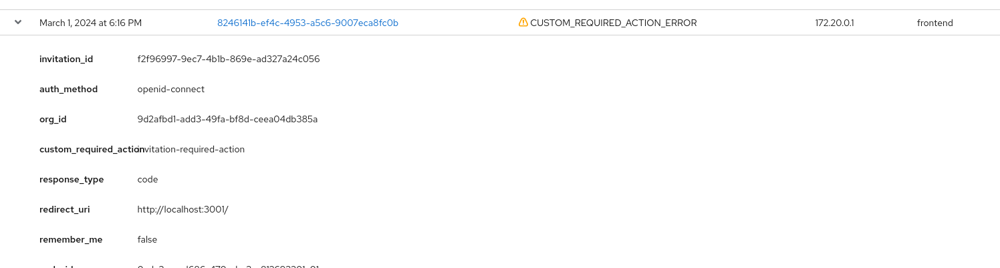
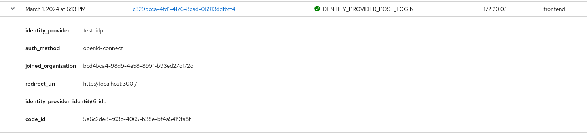
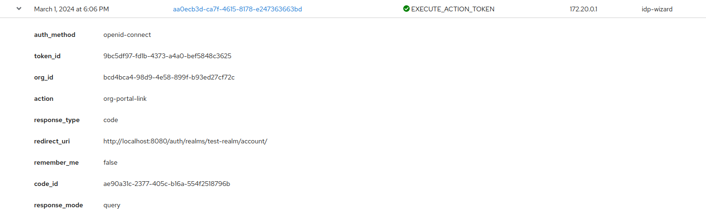

# Events

### Admin Events

Description of the events associated with the management of organizations:

| Path                                                                        | Method   | Event type                | Operation |
|-----------------------------------------------------------------------------|----------|---------------------------|-----------|
| `/auth/realms/:realmId/orgs`                                                | `POST`   | ORGANIZATION              | CREATE    |
| `/auth/realms/:realmId/orgs`                                                | `PUT`    | ORGANIZATION              | UPDATE    |
| `/auth/realms/:realmId/orgs`                                                | `DELETE` | ORGANIZATION              | DELETE    |
| `/auth/realms/:realmId/orgs/:orgId/members/:userId`                         | `PUT`    | ORGANIZATION_MEMBERSHIP   | CREATE    |
| `/auth/realms/:realmId/orgs/:orgId/members/:userId`                         | `DELETE` | ORGANIZATION_MEMBERSHIP   | DELETE    |
| `/auth/realms/:realmId/orgs/:orgId/roles/:roleName`                         | `POST`   | ORGANIZATION_ROLE         | CREATE    |
| `/auth/realms/:realmId/orgs/:orgId/roles/:roleName/:roleName`               | `DELETE` | ORGANIZATION_ROLE         | DELETE    |
| `/auth/realms/:realmId/orgs/:orgId/roles/:roleName/:roleName`               | `PUT`    | ORGANIZATION_ROLE         | UPDATE    |
| `/auth/realms/:realmId/orgs/users/:userId/orgs/:orgId/roles`                | `DELETE` | ORGANIZATION_ROLE_MAPPING | DELETE    |
| `/auth/realms/:realmId/orgs/users/:userId/orgs/:orgId/roles`                | `PATCH`  | ORGANIZATION_ROLE_MAPPING | CREATE    |
| `/auth/realms/:realmId/orgs/:orgId/roles/:roleName/users/:userId`           | `DELETE` | ORGANIZATION_ROLE_MAPPING | DELETE    |
| `/auth/realms/:realmId/orgs/:orgId/roles/:roleName/users/:userId`           | `PUT`    | ORGANIZATION_ROLE_MAPPING | CREATE    |
| `/auth/realms/:realmId/orgs/:orgId/roles/:roleName/users/:userId`           | `DELETE` | ORGANIZATION_ROLE_MAPPING | DELETE    |
| `/auth/realms/:realmId/orgs/:orgId/invitations/:invitationId`               | `POST`   | INVITATION                | CREATE    |
| `/auth/realms/:realmId/orgs/:orgId/invitations/:invitationId/:invitationId` | `DELETE` | INVITATION                | DELETE    |
| `/auth/realms/:realmId/orgs/:orgId/domains/:domainName/verify`              | `POST`   | DOMAIN                    | UPDATE    |

### User events

Description of the events associated with users in the context of a organization.

Organization management

| Path                                                | Method   | Event type      |
|-----------------------------------------------------|----------|-----------------|
| `/auth/realms/:realmId/users/switch-organization`   | `PUT`    | UPDATE_PROFILE  |
| `/auth/realms/:realmId/orgs/:orgId/members/:userId` | `DELETE` | UPDATE_PROFILE  | 

`Invitations` -  Event type: CUSTOM_REQUIRED_ACTION

`Post IdP login ("Add user to org" Authenticator)` - Event type: IDENTITY_PROVIDER_POST_LOGIN

`PortalLink` - Event type: EXECUTE_ACTION_TOKEN

