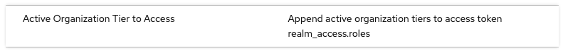
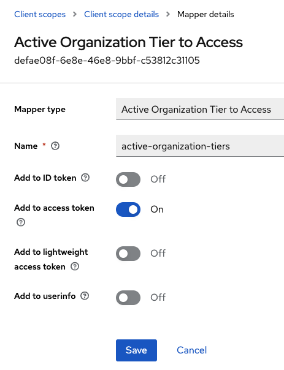
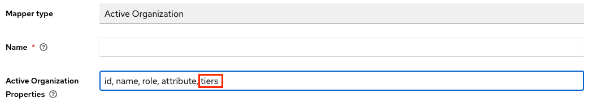
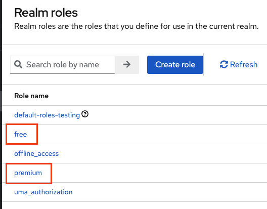
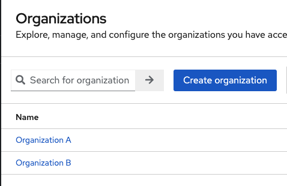
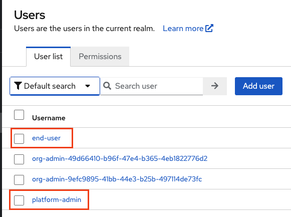
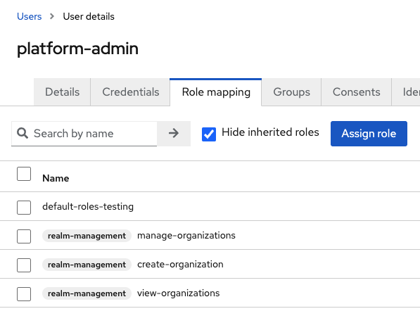
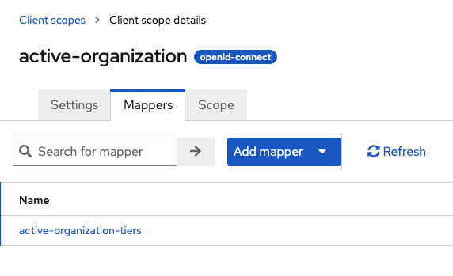
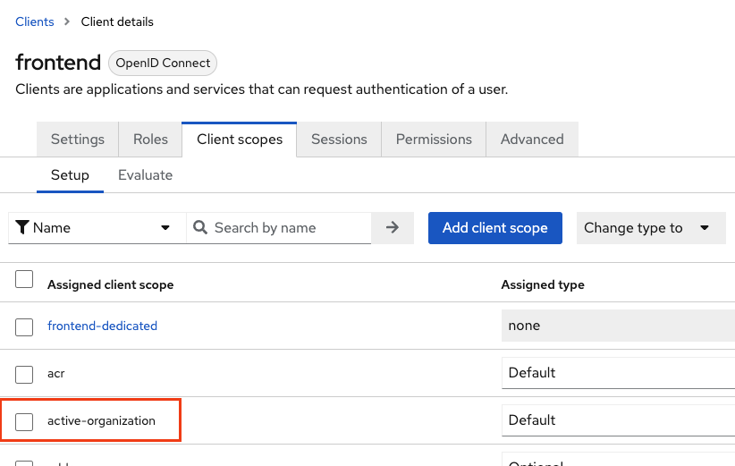

# Organization Tiers feature
## Status: Experimental

## Contents
<!-- TOC -->
* [Organization Tiers feature](#organization-tiers-feature)
  * [Status: Experimental](#status-experimental)
  * [Contents](#contents)
  * [Overview](#overview)
    * [Use Case](#use-case)
      * [Scenario](#scenario)
    * [Important note](#important-note)
  * [Endpoints](#endpoints)
  * [Token Mappers](#token-mappers)
  * [Demo flow](#demo-flow)
    * [Create realm roles](#create-realm-roles-)
    * [Create demo organizations](#create-demo-organizations-)
    * [Create users](#create-users)
    * [Assign necessary roles to admin](#assign-necessary-roles-to-admin-)
    * [Assign end-user to both demo organization](#assign-end-user-to-both-demo-organization)
    * [Create client scope with tier mapper](#create-client-scope-with-tier-mapper-)
    * [Create public client and assign client scope](#create-public-client-and-assign-client-scope)
    * [Assign tiers using platform admin](#assign-tiers-using-platform-admin-)
      * [**Free to Organization A**](#free-to-organization-a)
      * [**Premium to Organization B**](#premium-to-organization-b)
    * [End user demo](#end-user-demo-)
  * [Source Code Related to Feature](#source-code-related-to-feature)
<!-- TOC -->

## Overview
"__Organization Tiers__" refer to the capability to assign roles globally to an organization for a period of time.  
Those roles are then inherited by the organization members depending on configured Token Mappers.  

### Use Case
This feature may be useful in a SaaS Platform context with multiple tiers where you want to leverage Keycloak roles for that (_and eventually Authorization with Policies_).

#### Scenario
As the SaaS Platform creator or manager, you want to protect your platform products with 3 tiers:
- Free
- Premium
- Enterprise  

Where each allow the user to access different features on your platform.

Also, you may want to structure your users into organizations and allow a user to belong to multiple organization with different tiers.

Based on that scenario, and using this feature and active organization feature, you could achieve that.  
You could
- Create 2 realm roles: free, premium
- Create an Organization A and assign "Free Tier" (assign free realm role to the organization)
- Create an Organization B and assign "Premium Tier" (assign premium realm role to the organization)
- Configure the "Active Organization Tier to Access" mapper to the scopes you need
- Assign the User to both organization

Then, depending on the Active Organization context of the user, the "Organization Tier" (realm role) will be added 
to the _realm_access.roles_ claims of the access_token. 

Also, you can set an expiration date for the tier in the format yyyy-MM-dd. 
Upon retrieval or token mapping, if the tier is expired, it will be removed from the organization.

See [Demo flow](#demo-flow) for the step-by-step example.

### Important note
Currently, this features is based on Keycloak Roles capabilities and only realm level roles are supported. 

## Endpoints
Endpoints are inspired from Keycloak group role mapping logic, as it is very similar. 

- **GET** `...realms/{REALM}/orgs/{ORG-ID}/role-mappings`  

**Permission:** Should have view-organizations or a member of the organization.

<details>
<summary>Example response body</summary>

```json
{
  "realmMappings": [
    {
      "id": "516c1cc9-bd0e-4c7d-be3d-c6c995e3c795",
      "role": {
        "id": "8db76990-67ab-44bc-8e29-adb1e78178ec",
        "name": "free",
        "description": "",
        "composite": false,
        "clientRole": false,
        "containerId": "105aae3e-0be3-472e-8761-f85c6e13c4b9"
      },
      "expireDate": "2024-12-31"
    }
  ]
}
```

</details>

<br/>

- **PUT** `...realms/{REALM}/orgs/{ORG-ID}/role-mappings/realm`    

**Permission:** Should have create-organizations or create-organizations and manage-organizations.   

This endpoint create the tier if not existing or update the existing tier expiration date based on _role.id_ matching. 

<details>
<summary>Example request body</summary>

```json
[
  {
    "role": {
      "id": "8db76990-67ab-44bc-8e29-adb1e78178ec",
      "name": "free"
    },
    "expireDate": "2024-12-31"
  }
]
```

</details>

<br/>

- **DELETE** `...realms/{REALM}/orgs/{ORG-ID}/role-mappings/realm`

**Permission:** Should have create-organizations or create-organizations and manage-organizations.  

<details>
<summary>Example request body</summary>

```json
[
  {
    "id": "516c1cc9-bd0e-4c7d-be3d-c6c995e3c795",
    "role": {
      "id": "8db76990-67ab-44bc-8e29-adb1e78178ec",
      "name": "free"
    },
    "expireDate": "2024-12-31"
  }
]
```

</details>

## Token Mappers
2 new token mappers were added and 1 mapper was extended:
- New: "Active Organization Tier to Access"



This mapper will only add tiers to _realm_access.roles_ claims for the active organization of the user.


- New: "Organization Tier to Access"


This mapper will add tiers to _realm_access.roles_ claims from all organizations of the user.

You don't need to configure those mappers (except setting a name) as it has only 1 purpose: append tiers to _realm_access.roles_ claims.

Example:



- Update: "Active Organization"



So tiers could be mapped to active organization claim.

## Demo flow
### Create realm roles 



### Create demo organizations  



### Create users



### Assign necessary roles to admin  
To manage organization tiers, admin needs to have create-organizations or view-organizations and manage-organizations.



### Assign end-user to both demo organization

### Create client scope with tier mapper  



### Create public client and assign client scope



### Assign tiers using platform admin  
_(using API currently)_

#### **Free to Organization A**

**PUT** `...realms/{REALM}/orgs/{ORG-A-ID}/role-mappings/realm`

<details>
<summary>Example request body</summary>

```json
[
  {
    "role": {
      "id": "8db76990-67ab-44bc-8e29-adb1e78178ec",
      "name": "free"
    },
    "expireDate": "2024-12-31"
  }
]
```

</details>

<br>

#### **Premium to Organization B**

**PUT** `...realms/{REALM}/orgs/{ORG-B-ID}/role-mappings/realm`

<details>
<summary>Example request body</summary>

```json
[
  {
    "role": {
      "id": "ce536bbe-d560-4c17-a018-616780c0076a",
      "name": "premium"
    },
    "expireDate": "2024-12-31"
  }
]
```

</details>

### End user demo  

Organization A claims  
Now, defining the active organization of the end-user as Organization A and login in will map the 'free' tier (role) to
realm_access.roles claims
<details>
<summary>Org A context Token claims</summary>

```json
  "realm_access": {
    "roles": [
      "default-roles-testing",
      "offline_access",
      "uma_authorization",
      "free"
    ]
},
```

</details>

Organization B claims

Switching to Organization B, will change the mapped tier:
<details>
<summary>Switch to Organization B</summary>

**PUT** `...realms/{REALM}/users/switch-organization`
Body:

```json
{
  "id": "ORG-B-ID"
}
```

</details>

<details>
<summary>Org B context Token claims</summary>

```json
  "realm_access": {
    "roles": [
      "default-roles-testing",
      "premium",
      "offline_access",
      "uma_authorization"
    ]
},
```

</details>


## Source Code Related to Feature
Added:  
Entity
- [`OrganizationTierMappingEntity.java`](../src/main/java/io/phasetwo/service/model/jpa/entity/OrganizationTierMappingEntity.java)  

Model
- [`TierAdapter.java`](../src/main/java/io/phasetwo/service/model/jpa/TierAdapter.java)
- [`TierMapperModel.java`](../src/main/java/io/phasetwo/service/model/TierMapperModel.java)
- [`TierModel.java`](../src/main/java/io/phasetwo/service/model/TierModel.java)

OIDC Mappers
- [`ActiveOrganizationTierMapper.java`](../src/main/java/io/phasetwo/service/protocol/oidc/mappers/ActiveOrganizationTierMapper.java)
- [`OrganizationTierMapper.java`](../src/main/java/io/phasetwo/service/protocol/oidc/mappers/OrganizationTierMapper.java)

Representation
- [`OrganizationTier.java`](../src/main/java/io/phasetwo/service/representation/OrganizationTier.java)
- [`OrganizationTierMapping.java`](../src/main/java/io/phasetwo/service/representation/OrganizationTierMapping.java)

Resource
- [`OrganizationTierMappingsResource.java`](../src/main/java/io/phasetwo/service/resource/OrganizationTierMappingsResource.java)

Util
- [`DateFormatter.java`](../src/main/java/io/phasetwo/service/util/DateFormatter.java)
  - _To enforce a specific date format for expiration date_

Test
- [`OrganizationTierMappingsResourceTest.java`](../src/test/java/io/phasetwo/service/resource/OrganizationTierMappingsResourceTest.java)

Modified:
- [`OrganizationAdapter.java`](../src/main/java/io/phasetwo/service/model/jpa/OrganizationAdapter.java)
- [`ActiveOrganizationMapper.java`](../src/main/java/io/phasetwo/service/protocol/oidc/mappers/ActiveOrganizationMapper.java)
